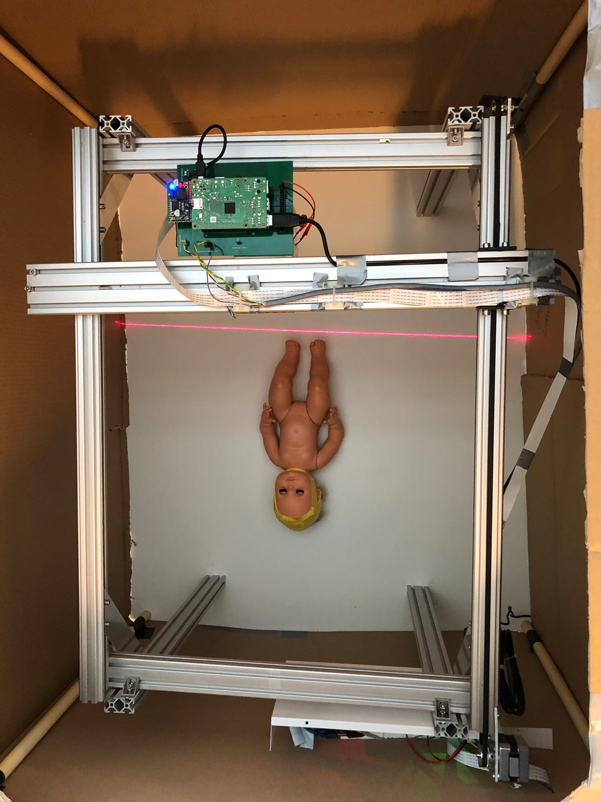
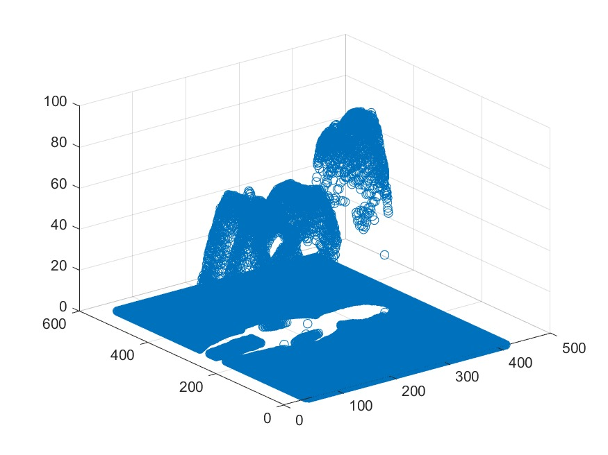
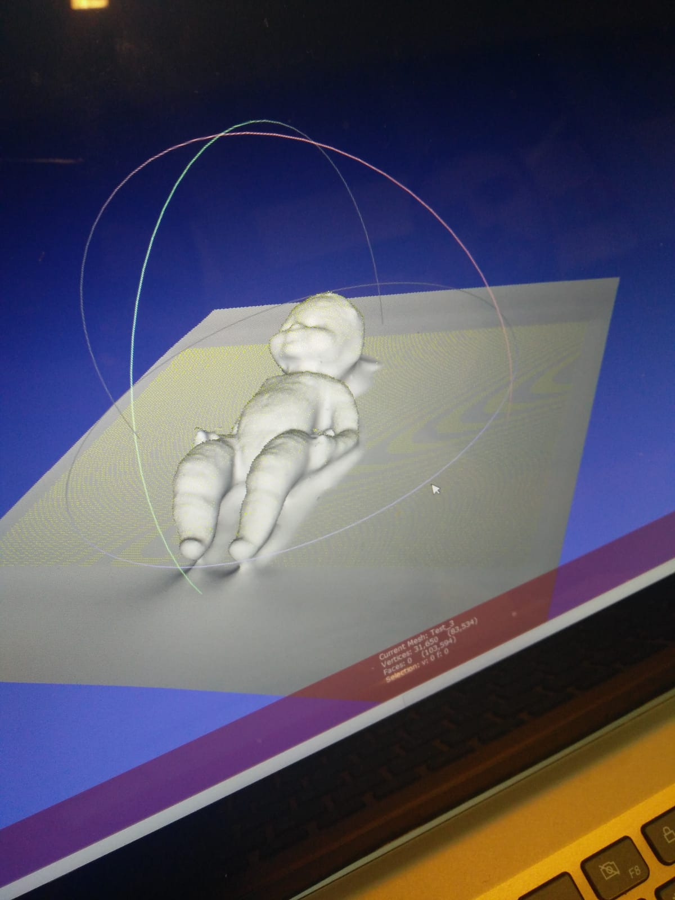
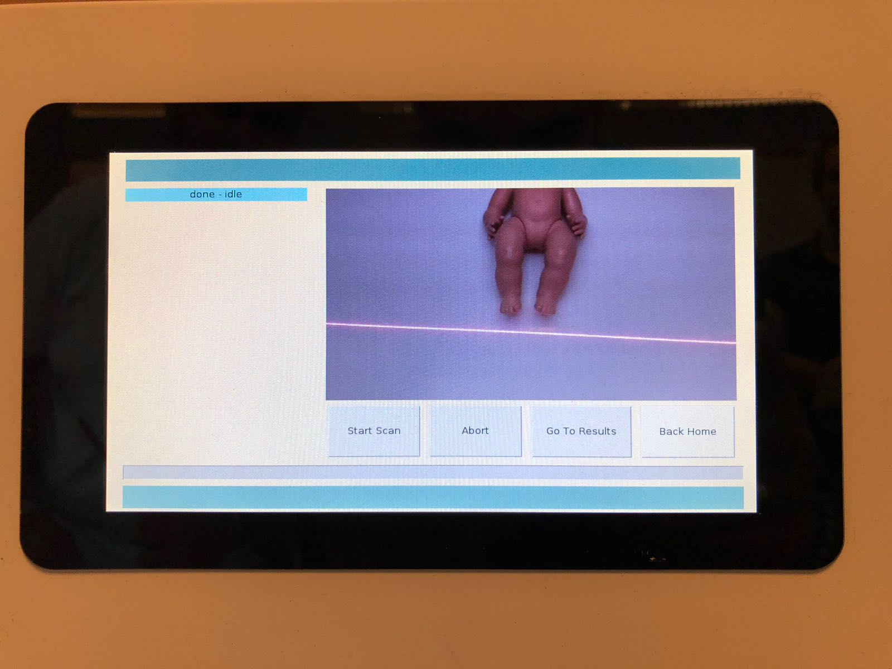

# BabyScan  - Een Open-Source 3D Laser Scanner

## Wat is BabyScan

Het BabyScan project is gestart in 2017 aan de Hogeschool Rotterdam bij de opleiding Elektrotechniek in partnership met het Erasmus MC. Het doel is om een 3D beeld te genereren van een baby in een couveuse, zodat de groei kan worden bijgehouden. Na inspiratie te hebben gevonden in het FabScan PI project, was het idee gebeuren om iets soortgelijks te ontwerpen met een Raspberry Pi 3, Raspberry Pi Camera Module en een laser diode. De huidige versie is ook geschreven in python, arduino en matlab.

https://github.com/kaiharten/baby3dscanner

## Status
* Nauwkeurigheid lengte is 5mm
* Nauwkeurigheid hoogte is 5mm
* Stappenmotoren erg luid.

## To Do
* Stappenmotoraansturing optimaliseren, geruisloos maken. Wellicht met controllers van TMC Trinamic
* Het uitlezen van images uit de camera sneller en betrouwbaarder qua tijd. Wellicht op een RTOS en afstappen van python.
* Het verwerkalgoritme optimaliseren, om de snelheid te verbeteren. 
* Het verwerkalgoritme aanpassen, zodat het met meer licht nog steeds werkt.
* Nauwkeurigheid op lengte naar 0.1mm krijgen.
* Nauwkeurigheid op hoogte naar 1mm krijgen.
* Door plexiglas heen meten.
* Het volledige systeem stand-alone draaien.

## Documentatie
* [Getting Started - Systeemhandleiding](https://github.com/kaiharten/baby3dscanner/blob/master/docs/getting_started.md)
* [Matlab Script Handleiding](https://github.com/kaiharten/baby3dscanner/blob/master/docs/matlab_script_gebruikshandleiding.pdf)
* [Software Ontwerpbeschrijving](https://github.com/kaiharten/baby3dscanner/blob/master/docs/software_ontwerpbeschrijving.pdf)
* [Hardware Ontwerpbeschrijving](https://github.com/kaiharten/baby3dscanner/blob/master/docs/hardware_ontwerpbeschrijving.pdf)
* [Onderzoeksrapport Hoogtemetingen](https://github.com/kaiharten/baby3dscanner/blob/master/docs/onderzoeksrapport_hoogtemetingen.pdf)
* [Acceptatietest](https://github.com/kaiharten/baby3dscanner/blob/master/docs/acceptatietest.pdf)
* [Requirements/Specificaties](https://github.com/kaiharten/baby3dscanner/blob/master/docs/specificaties_requirements.pdf)

## Core Team
* Kai Harten
* Timothy Singowikromo
* Jure Vidmar
* Talha Koçak

## Resultaten

